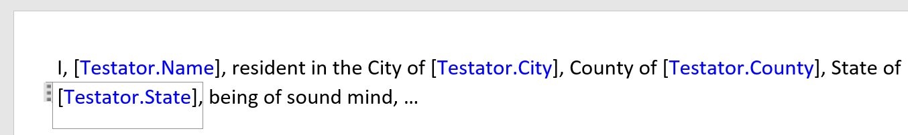
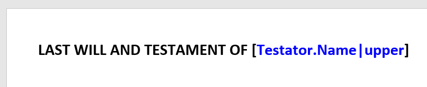
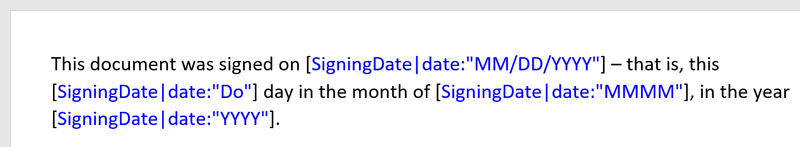
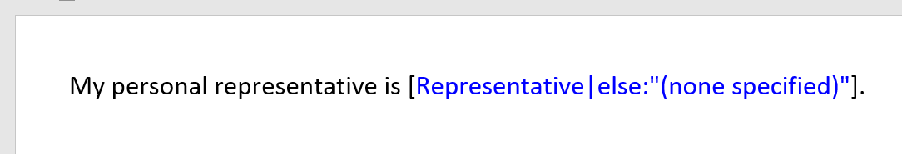
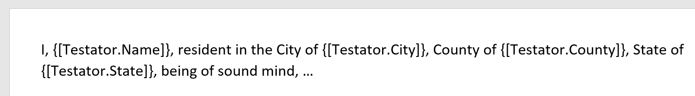

opendocx-node
=============

**[OpenDocx](https://github.com/opendocx/opendocx) document assembly for Node.js applications.**

This package is still somewhat experimental in nature. If it interests you, please try it out and share your feedback.

opendocx-node facilitates "document assembly": a template-based approach to automatically generating documents.  At this point, templates are expected to be Microsoft Word DOCX files (on disk).  Plain text templates (with basically an identical feature set) can also be assembled using the companion package [Yatte](https://github.com/opendocx/yatte), from which OpenDocx derives much of its functionality.

Installation
------------

[](https://nodei.co/npm/opendocx-node/)

Templates
---------

Template markup is accomplished using "fields" to describe how the document content and structure should be modified when a document is being assembled. OpenDocx currently supports three types of fields: Content, If, and List. More samples (and possibly additional types of fields!) are coming soon.

When using Word DOCX files as templates, fields are placed inside Word _content controls_. Inside a content control, a field is visually delimited with square brackets. In the example screen shots below, different types of fields are shown in different colors. Such formatting is for illustration and convenience only, and is not required.

### _Content_ fields

_Content_ fields cause text to be added (merged) into the document:



Content fields contain [expressions](https://docs.angularjs.org/guide/expression) that are evaluated against the data supplied to the assembly process (known as the "data context") to produce text to be merged into the document at that point. In the above example, the data context contains an object named Testator, and that object has (at least) 4 string properties named Name, City, County and State.
If an expression cannot be resolved to a value, OpenDocx will instead merge the expression itself, surrounded in square brackets, as an indication that the required data was not provided.

In short, a content field evaluates whatever expression is in the field and merges the resulting text into the document.

#### Filters

Expressions (whether in OpenDocx fields, or fields in plain text templates in [Yatte](https://github.com/opendocx/yatte)) can optionally include _filters_, which allow values to be modified before they are merged. Filters are defined for:

* Formatting text as **upper** case, **lower** case, **titlecaps** (each word capitalized), and **initcap** (first word capitalized):
  
  

* Formatting **date** values (using tokens defined by [date-fns](https://date-fns.org/v1.30.1/docs/format)):
  
  

* Formatting **number** values (using tokens defined by [Numeral.js](https://numeraljs.com/#format))

* Formatting true/false values using the **tf** filter

* Formatting missing values using the **else** filter:
  
  

#### Alternate field syntax

Screen shots in this document show fields embedded in Word content controls. An alternate syntax is also available, where fields can be embedded in the regular flow of text in Word:



This may be useful if the environment in which you edit templates makes it difficult to use Word content controls. This alternate syntax matches the way fields are delimited in [Yatte](https://github.com/opendocx/yatte)'s plain text templates: in essence, the curly braces play the part of the Word content control, and inside that, the square brackets identify the content as a Yatte field.

### _if_ fields

**if** fields cause a portion of the document to be included (or excluded) based on logical conditions.
```
[First] [if Middle][Middle] [endif][Last]
```

An **if** field contains an expression that is evaluated for purposes of determining whether to include the text between _if_ and _endif_.  If this expression evaluates to a true (or [truthy](https://j11y.io/javascript/truthy-falsey/)) value, the text between the fields is included; otherwise it is excluded from the assembled text.

If fields can also include alternatives ("else") or chains of alternatives ("elseif").

#### _list_ fields cause a portion of the document to be repeated as many times as is dictated by the data provided by the caller. Lists can also be nested as deeply as necessary.
```
My beneficiaries are:
[list beneficiaries]
* [Name], currently of [Address]
[endlist]
```

As with _if_ fields, the _list_ field contains an expression – "beneficiaries" in the example above. However, for _list_ fields, this expression is expected to evaluate to a list of items.  (Specifically, in JavaScript parlance, it must evaluate to any _iterable_ – often, but not necessarily, an array.)  When this expression is evaluated, the resulting list of values is kept in temporary memory and is used to determine both how many repetitions of the template content are necessary, and then for each repetition, that item in the array (or iterable) serves as the data context for all expressions evaluated until the _endlist_ field is reached.

Usage
-----

opendocx-node's public API includes two methods: compileDocx() and assembleDocx(). Both are asynchronous -- that is, they return a promise rather than performing synchronously.

```javascript
async function compileDocx(templatePath)
```
compileDocx() is used to "compile" and register a template with the system. This pre-processes the template, extracting template logic into an external .js file, analyzing it for errors, and restructuring it to optimize for performance when generating documents.

CompileDocx should ideally be called (once) prior to calling assembleDocx for the same template. (Ideally, compileDocx should be called whenever a new version of a template is first put into service.)

```javascript
async function assembleDocx(templatePath, data, outputFile)
```
As with yatte, data is supplied to assembleDocx as a JavaScript object.

```javascript
const openDocx = require("opendocx-node");
const assert = require('assert');

const templatePath = 'SimpleWill.docx';
const data = {FirstName: "John", LastName: "Smith", ...};
const result = await openDocx.assembleDocx(templatePath, data, 'assembled.docx');
assert(exists(result.Document))
assert(!result.HasErrors);
```

The implementation checks to make sure the files generated by compileDocx() exist on disk, and if they do not, it calls compileDocx automically prior to attempting assembly. However, it is still strongly suggested to to always call compileDocx any time a new version of a template is put into service, to ensure those files are up to date and version-matched to the template.

Prior Art
---------

* OpenDocx uses [Open-Xml-Power-Tools](https://github.com/EricWhiteDev/Open-Xml-PowerTools) for 100% reliable manipulation of DOCX files. Special thanks to Eric White, maintainer of that project, for inspiration and suggestions during the formative stages of this one.

* [docxtemplater](https://docxtemplater.com/) served as an exemplar of node.js-based document assembly. In particular, this project put me onto...

* [angular-expressions](https://github.com/peerigon/angular-expressions#readme) (derived from [Angular](https://angular.io/)) provdides OpenDocx' flexible ability to use data from any JavaScript context.

* OpenDocx derived inspiration for its field syntax from the excellent JavaSript templating engines...
  * [Dust.js](https://www.dustjs.com/)
  * [Swig](http://node-swig.github.io/swig-templates/)
  * [Nunjucks](https://mozilla.github.io/nunjucks/)

Sponsors
--------

Development of OpenDocx was made possible through the sponsorship of [REAL Automators, Inc.](https://realautomators.com/).